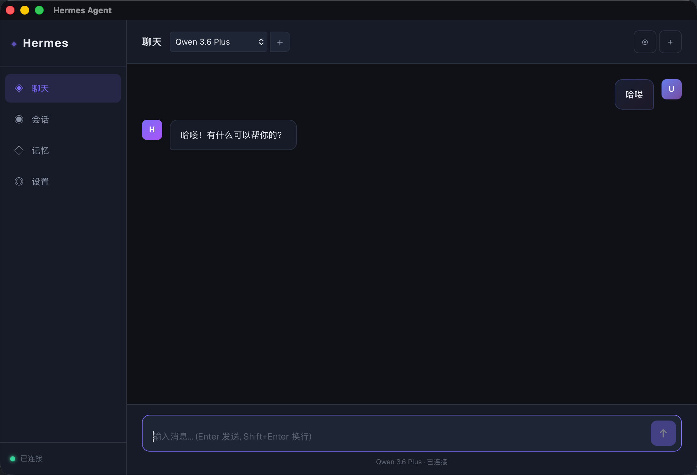
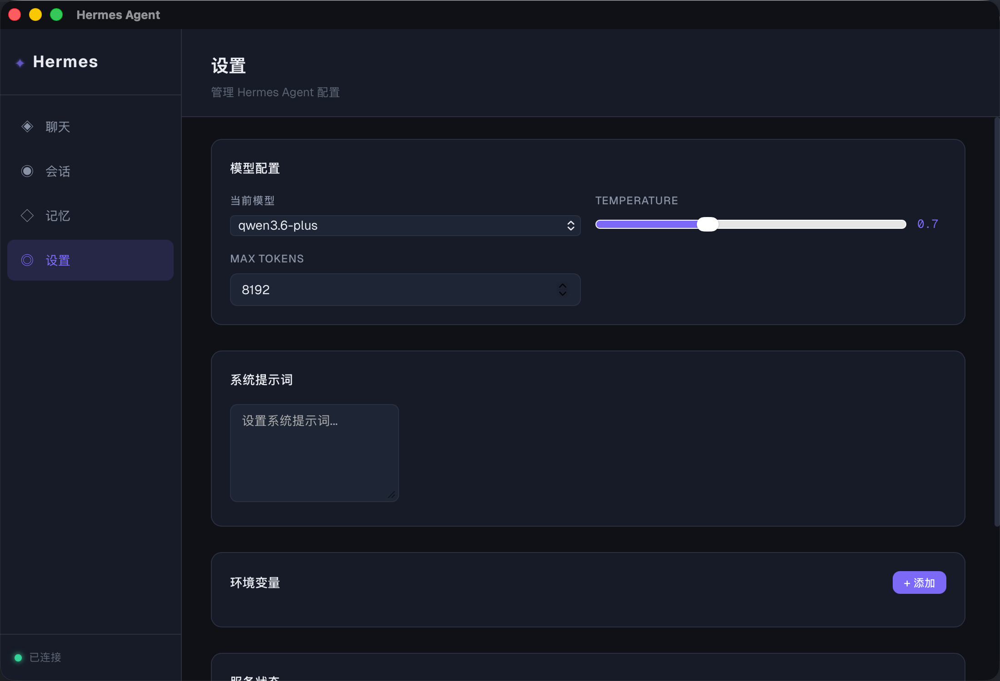

# Hermes GUI

基于 Tauri + Vue 3 的 Hermes Agent 图形界面客户端。

## 界面预览





## 功能

- 🤖 多模型支持（Qwen、DeepSeek、Claude 等）
- 💬 实时流式对话
- 📁 历史会话管理
- 🧠 记忆系统集成
- ⚙️ 自定义模型配置

## 技术栈

- **前端**: Vue 3 + Vite 8 + TypeScript 6 + Pinia 3 + Vue Router 4 + UnoCSS
- **桌面**: Tauri 2
- **后端**: Python (Hermes Bridge)

## 开发

```bash
# 安装依赖
pnpm install

# 开发模式
pnpm tauri dev

# 构建
pnpm tauri build
```

## 启动 Bridge Server

```bash
cd ~/.hermes/hermes-agent
./venv/bin/python3 server/chat_bridge.py
```

## 项目结构

```
hermes-gui/
├── src/                 # Vue 前端源码
│   ├── pages/          # 页面组件
│   ├── stores/          # Pinia 状态管理
│   └── ...
├── server/             # Bridge Server
│   └── chat_bridge.py  # WebSocket 桥接服务
└── src-tauri/          # Tauri 桌面应用
```

## 配置

首次使用需要在 Bridge Server 中配置 API Key：

```bash
# 设置环境变量
export DASHSCOPE_API_KEY=your_key  # 阿里云百炼
export ANTHROPIC_API_KEY=your_key  # Claude
```

## Windows 支持

### 前置要求

- Python 3.8+
- Node.js 18+
- Rust (安装 Rust: https://rustup.rs/)

### 构建步骤

```powershell
# 安装依赖
pnpm install

# 开发模式
pnpm tauri dev

# 构建 Windows 安装包
pnpm tauri build
```

构建产物位于 `src-tauri/target/release/bundle/`:
- MSI 安装包
- NSIS 安装程序 (.exe)

### 启动 Bridge Server (Windows)

```powershell
# 方法 1: 使用启动脚本
cd server
.\start_bridge.bat

# 方法 2: 手动启动
cd %USERPROFILE%\.hermes\hermes-agent
python server\chat_bridge.py
```
